# Build Connection to OBP

## Introduction

In this lab, we will set up an API call to OBP using an OIC REST Adaptor.
Estimated Time: 15 minutes


### Objectives

In this lab, you will complete the following tasks:

- Search connections in OIC
- Create REST adaptor
- Test connection

### Prerequisites

This lab assumes you have:
- An Oracle Always Free/Free Tier, Paid or LiveLabs Cloud Account
- Created an OIC instance

## Task 1: Search connections in OIC

1. From the OCI homepage, select the hamburger menu in the top left and then **Developer Services,** followed by **Integration** under the Application Integration option. 

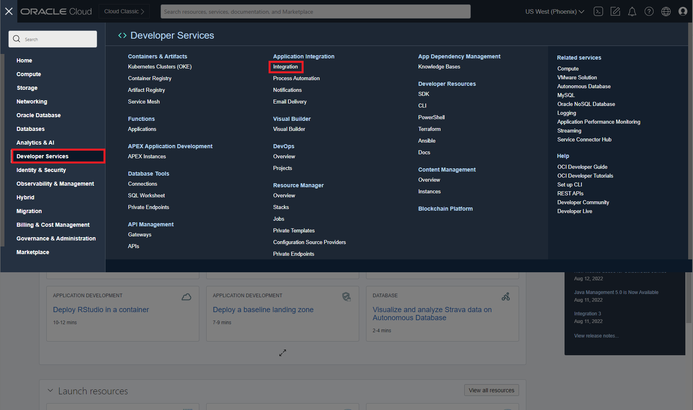 

2. In the new window that opens, select your OIC instance.

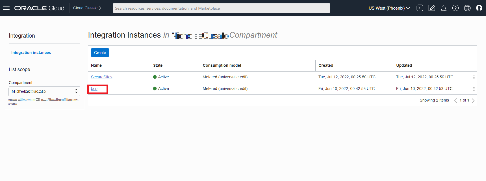 

3. Select the **Service Console** to open OIC.

 

4. Select the hamburger menu in the top left and then **Integrations**.

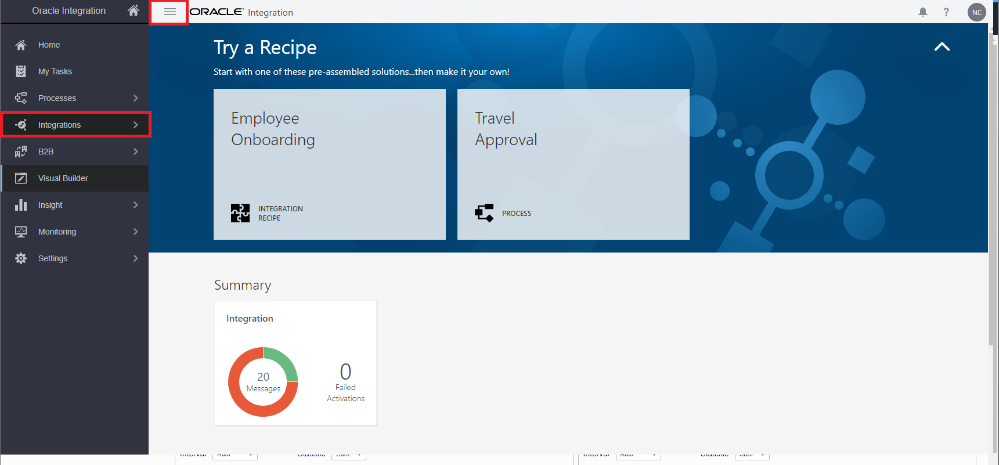 

5. Select **Connections**.

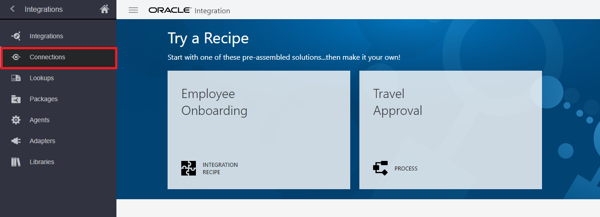 

6. Select **Create** to begin the process.

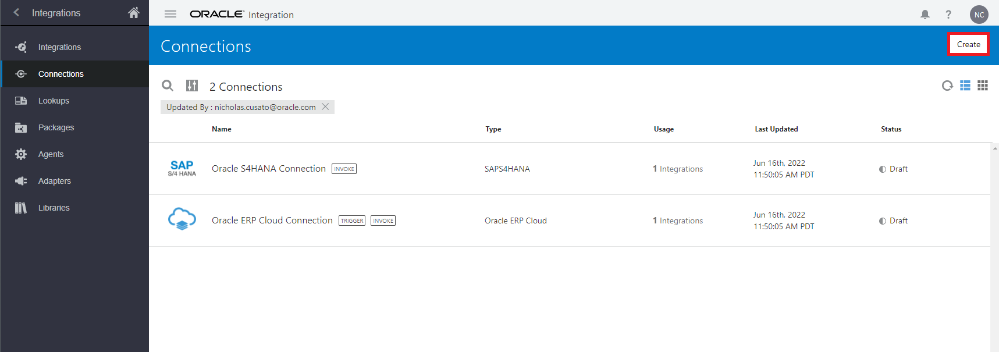 

7. Search and select **REST Adapter** in the popup window.

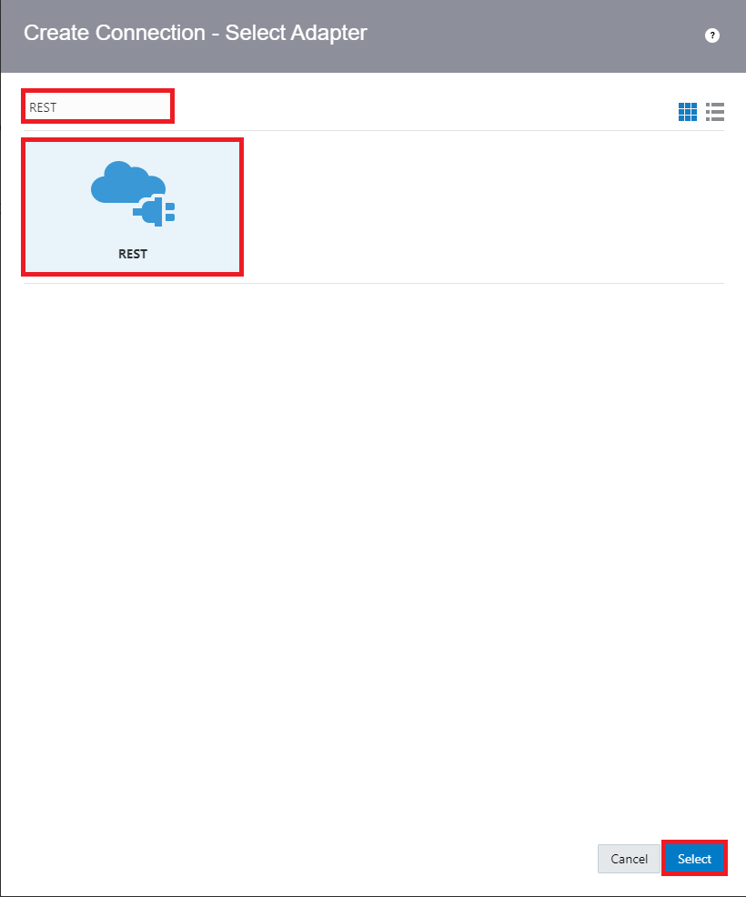 

## Task 2: Create REST adaptor

1. Fill out the connection details as such:
    
    ```
    Name: OBPBalanceTransfer
    Identifier: OBPBALANCETRANSFER (auto-populates)
    Keywords: Blockchain (optional)
    Role: Trigger and Invoke
    Description: Optional
    ```
    Click **Create** after finished.

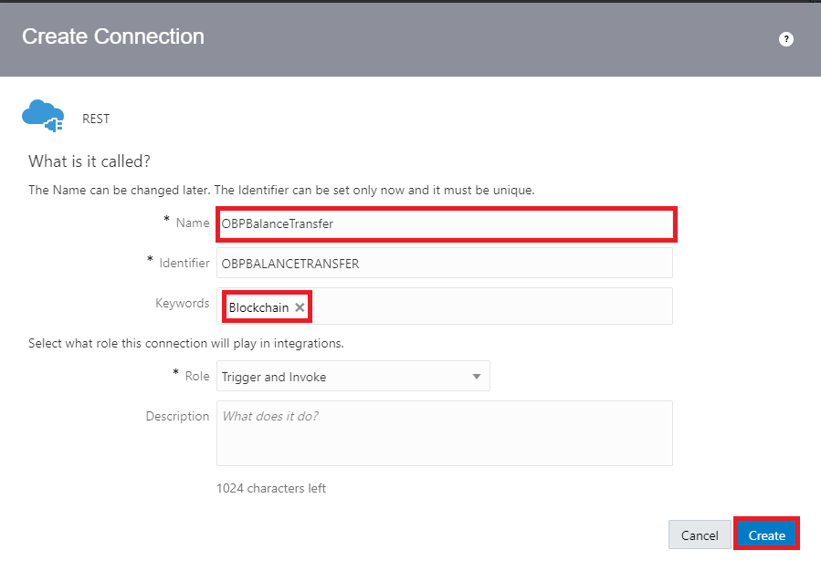 

2. Fill out the connection properties as such:

    ```
    Connection Type: REST API Base URL
    TLS Version: TLSv1.2
    Connection URL: <Restproxy_connection_string_from OBP>
    Security: Basic Authentication
    Username: <your:_username>
    Password: <your_password>
    ```

    >**NOTE** If you are working with a federated account this will not work, as the API proxy only works for non-SSO accounts. 

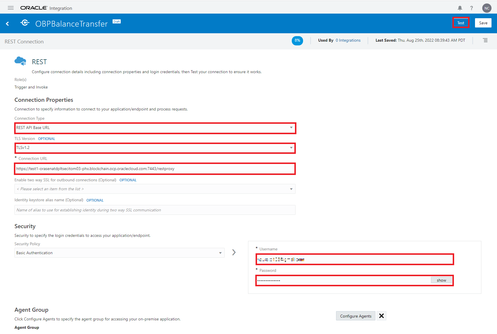 

The REST proxy URL is located in the **OBP Nodes** section.

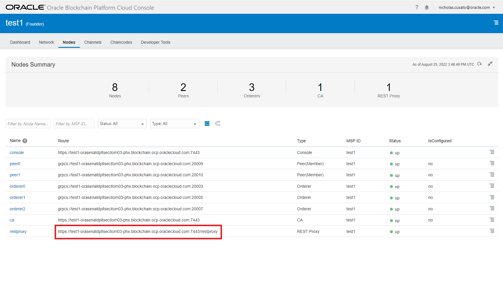

## Task 3: Test connection

1. Select **Test** to ensure everything is correct.

2. Select **Save** to move on to the next step.

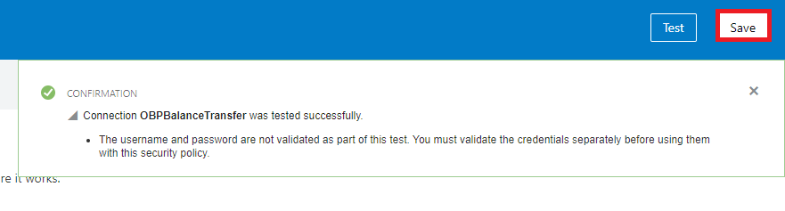 

3. Select *left arrow button** to exit the connection screen.

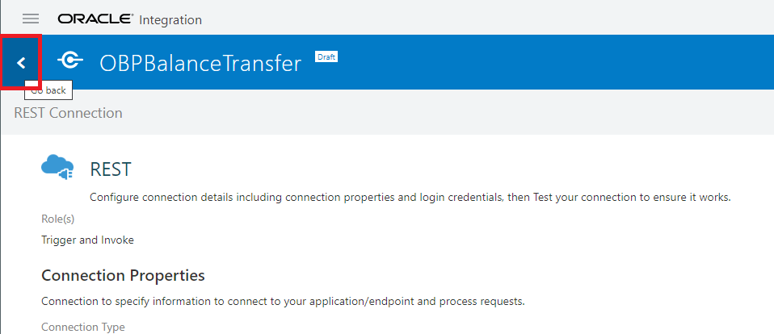 

## Acknowledgements

- **Author**- Nicholas Cusato, Santa Monica Specialists Hub, September 2022
- **Contributers**- Jens Lusebrink, Christophe Peytier
- **Last Updated By/Date** - Nicholas Cusato, September 1, 2022