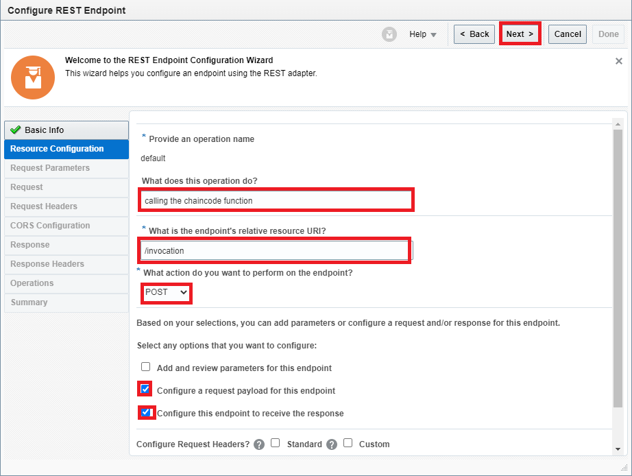
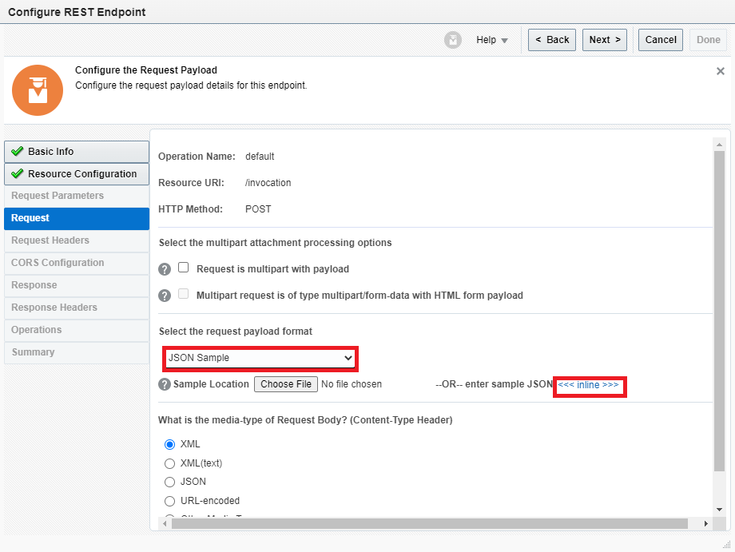

# Build Integration in OIC

## Introduction

In this lab, we will create an integration in OIC drive this REST connection to OBP. We will declare JSON payloads to enable mapping between integration points.

Estimated Time: 15 minutes

### Objectives

In this lab, you will complete the following tasks:

- Search App Driven Orchestration
- Create Sample REST Endpoint
- Declare JSON payload for REST
- Declare response JSON payload for REST
- Create OBP Balance Transfer Invocation
- Declare JSON payload for OBP
- Declare response JSON payload for OBP
- Map to Invocation from Sample REST Endpoint
- Map to Invocation from OBP Balance Transfer Endpoint
- Add Tracking
- Activate Integration
  

### Prerequisites

This lab assumes you have:
- An Oracle Always Free/Free Tier, Paid or LiveLabs Cloud Account

## Task 1: Create Predictive Model

1. Notice the new connection populated from the previous lab. Select **Integrations** in the menu bar to the left.

     

2. Select **Create** to begin the process.

     

3. Select **App Driven Orchestration** from the available integration styles and click **Select** to continue.

     

6. Fill out the form as such:

    ```
    Name: BalanceTransferIntegration
    Identifier: BALANCETRANSFERINTEGRATION (auto-populated)
    Version: 01.00.0000
    ```

    Select **Create** to proceed to next step.

     

## Task 2: Create Sample REST Endpoint

7. Select the **Sample REST Endpoint** Trigger to configure the endpoint.
   
     

8. Give a name for the endpoint and click **Next** to continue.
   
     

9.  Fill out the information for the resource configuration as such:
    
    ```
    What does this operation do: calling the chaincode function (optional)
    What is the endpoint's relative resource URI: /invocation
    What action do you want to perform on the endpoint: POST
    ```

    Select the tick-boxes for:

    ```
    Configure a request payload for this endpoint
    Configure this endpoint to receive the response
    ```
   
     

## Task 3: Declare JSON Payload for REST

10. Select **JSON Sample** for the request payload format and then, click **inline** to enter sample JSON. 

     

11. Copy and paste the following sample JSON payload for the request:

    ```
    <copy>
    {
     "channel": "x",
     "chaincode": "x",
     "method": "x",
     "scalararg":"a",
     "chaincodeVer": "x"
    }
    </copy>
    ```

12. Select **JSON** for the media type to receive and then select **Next.** 

     

## Task 4: Declare Response JSON for REST

13. Select **JSON Sample** for the request payload format and then, click **inline** to enter sample JSON. 

    

14. Copy and paste the following sample result payload for the request:

    ```
    <copy>
    {
    "returnCode": "x",
    "result": {
    "payload": "x",
    "message": "",
    "encode": "x"
    },
    "txid": "x"
    }
    </copy>
    ```

     

15. Select **JSON** for the media type to receive and then select **Next.** 

     

16. On the summary page, select **Done** to finish the configuration.

     

## Task 5: Create OBP Balance Transfer Invocation

1. Hover the mouse over the line connecting the Invocation to Map to Invocation. Click the **Plus sign** that appears and select the **OBPBalanceTransfer.

     

2. Fill out the following on the basic information page:
    
    ```
    What do you want to call your endpoint: InvocationToBlockchain
    What is the endpoint's relative resource URI: /invocation
    What action do you want to perform on the endpoint: POST
    ```

    Select the tick-boxes for:

    ```
    Configure a request payload for this endpoint
    Configure this endpoint to receive the response
    ```

     

    Select **Next** to proceed to next step.

## Task 6: Declare JSON payload for OBP

1. Select **JSON Sample** for the request payload format and then, click **inline** to enter sample JSON. 

    

2. Copy and paste the following jason payload for the actual values:

    ```
    <copy>
    {
    "channel": "x",
    "chaincode": "x",
    "method": "x",
    "args":["a"],
    "chaincodeVer": "x"
    }
    </copy>
    ```

    Select **OK** to proceed.

     

## Task 7: Declare response JSON payload for OBP

1. Select **Next** to proceed to response payload.

    

22. Do the same for the response payload, using the following:

    ```
    <copy>
    {
    "returnCode": "x",
    "result": {
    "payload": "x",
    "message": "",
    "encode": "x"
    },
    "txid": "x"
    }
    </copy>
    ```

    Click **OK** and **Next** to proceed to summary.

    

    

23. Select **Done** on the summary screen.

    

## Task 8: Map to Invocation from Sample REST Endpoint

1. In order to create a mapping between REST endpoints, click the top (or left - if horizontal) **Map to Invocation** and select the **pencil icon**  

    

2. On the mapping page, select the **drop-down arrows** of each request wrappers and draw a line from each of the mappings:

    ```
    -Channel
    -Chaincode
    -method
    -scalararg
    -chaincodeVar
    ```

    

Select **Validate** and then **Close** to proceed.

## Task 9: Map to Invocation from OBP Balance Transfer Endpoint

1. Select the bottom **Map to invocation** and click the **pencil icon.**

   

2. On the mapping page, similar to before, select the **drop-down arrows** of each request wrappers (Instead, this time for the first REST option in source) and draw a line from each of the mappings:

    ```
    -returnCode
    -payload
    -message
    -encode
    -txid
    ```

    

Select **Validate** and then **Close** to proceed.

## Task 10: Add Tracking

1. On the pipeline page, select the hamburger menu at the top right and click **Tracking.**

    

2. Drag **Channel** from the left side onto the blank field on the first line.

    

3. On the integration page, select **Save** and **Close** 

    

## Task 11: Activate Integration

1. Click on the **Pushbutton** icon to activate the integration. 

   

2. Select **Enable Asserter Recording,** **Enable tracing,** and **include payload** plus **Activate** to proceed. Wait for confirmation, when the status changes to active you are ready to proceed to next lab.

   

## Acknowledgements

- **Author**- Nicholas Cusato, Santa Monica Specialists Hub, September 2022
- **Contributers**- Jens Lusebrink, Christophe Peytier
- **Last Updated By/Date** - Nicholas Cusato, September 1, 2022