# Initialize OBP

## Introduction

In this lab, we will install a sample Oracle Blockchain Platform (OBP) chaincode and then, instantiate and test the sample. 
Estimated Time: 20 minutes


### Objectives

In this lab, you will complete the following tasks:

- Login to OBP
- Install sample chaincode
- Test the chaincode

### Prerequisites

This lab assumes you have:
- An Oracle Always Free/Free Tier, Paid or LiveLabs Cloud Account
- Instance of OBP 

## Task 1: Login to OBP

1. From OCI, open the hamburger menu in the top left and select **Developer Services**, then **Blockchain Platform.** 

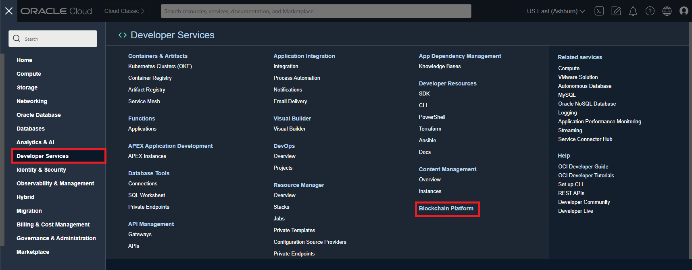 

2. Select an existing Blockchain instance.

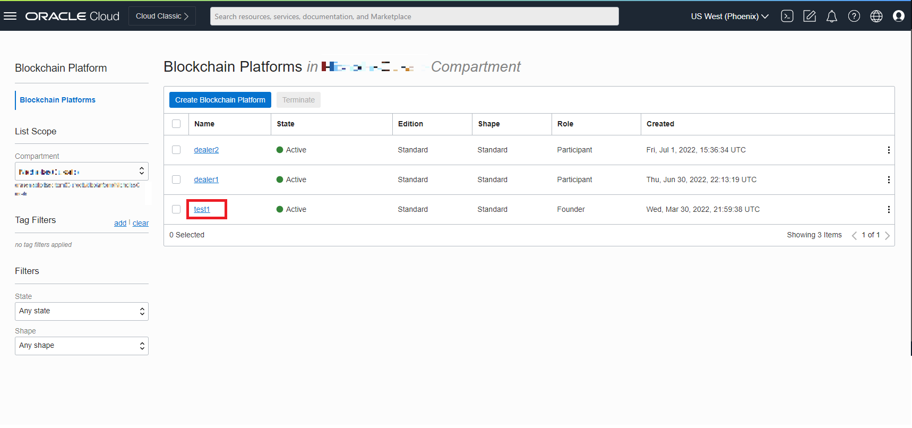 

3. From the instance portal, select **Service Console.**

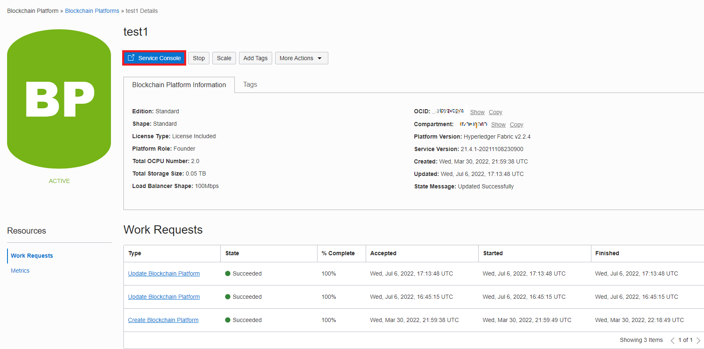 

4. From the service console's menu bar, select **Channels.** Create a new channel by selecting the blue button that says **Create a New Channel.**

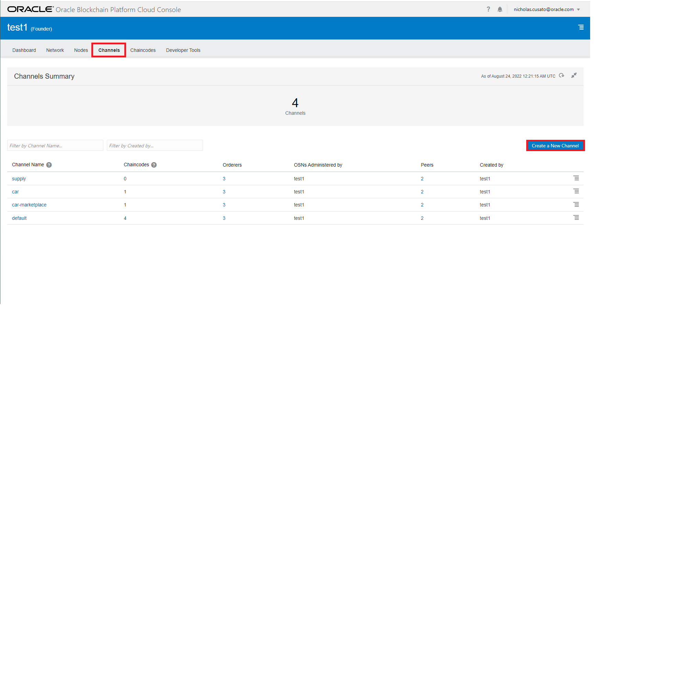 

5. Enter the following information:
   
    ```
    Channel Name: balancetransfer
    Organizations: <your_instance_name>
    Peers: peer0
    ```
Afterwards click on ‘Submit’ and a new channel will be created.

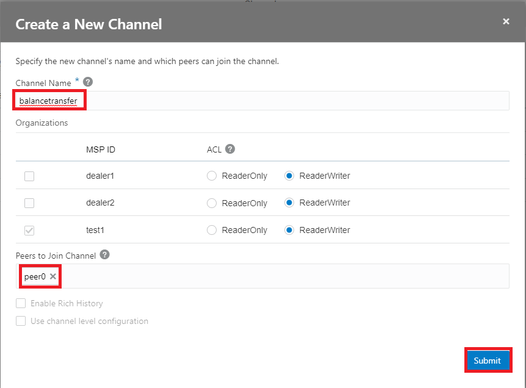 

7. Select **Developer Tools** from the menu bar and then select **Samples.** Notice the Balance Transfer sample code and select **Install.**

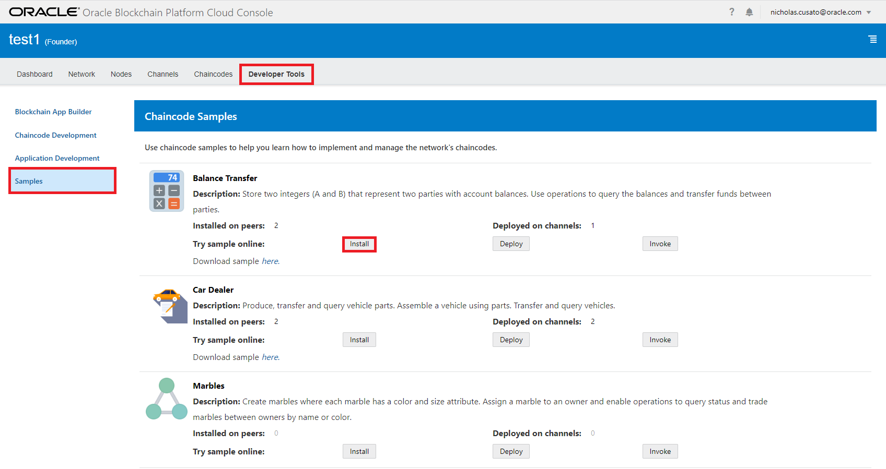 

8. Select the language **Node.js** and peer **peer0** that you had assigned in the previous step.

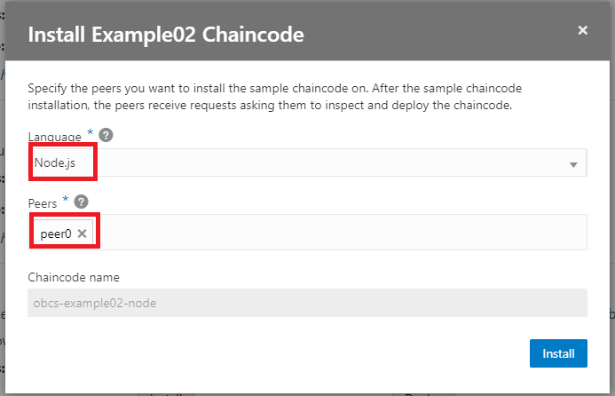 

9. Select the channel you just created **balancetransfer** and initial parameters for A and B respectively, **100** and **200**.

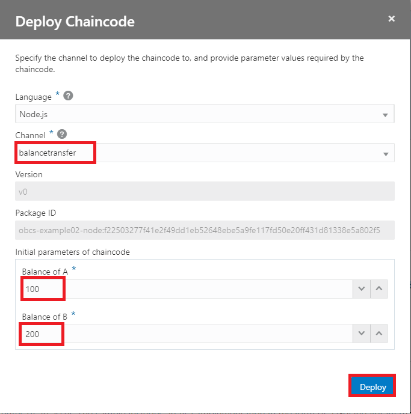 

10. Select the channel you just created **balancetransfer** and leave everything else default. Select **Execute.**

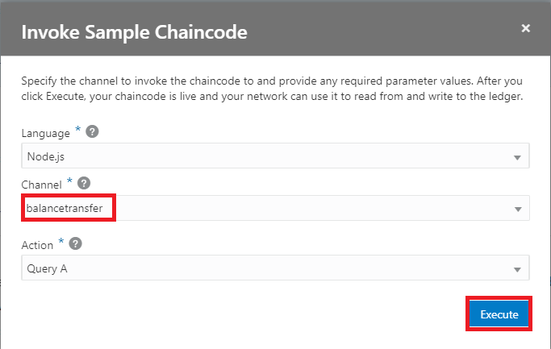 

11. After a successful execution of the invocation, scroll down the page to see more details about the invoke request.

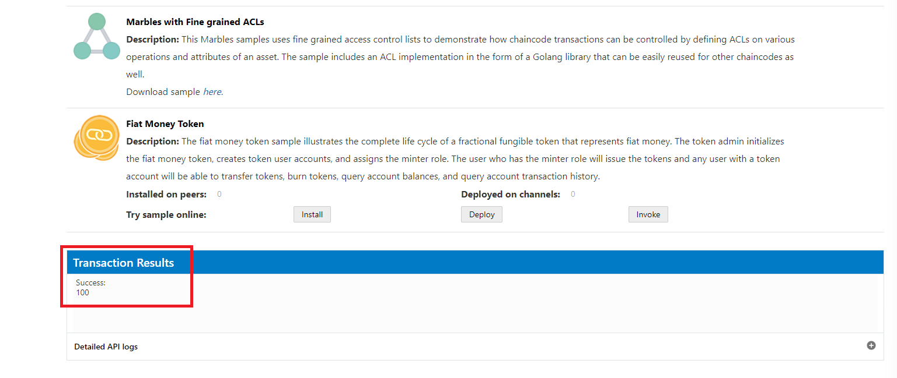 

12. Select **Channels** from the top menu options and then, the channel that we created **balancetransfer.** From here, we can view the **Ledger** by selecting it, followed by the most recent block, which will show the transaction ID. Select the **drop-down arrow** to view the details of the query.

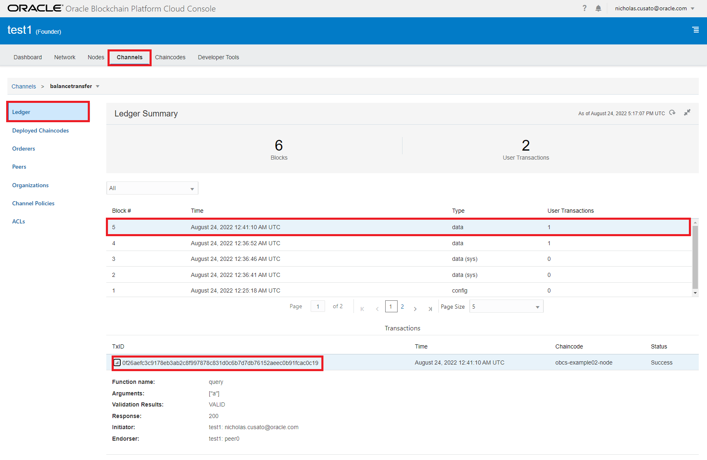 

## Acknowledgements

- **Author**- Nicholas Cusato, Santa Monica Specialists Hub, August 22, 2022
- **Contributers**- Jens Lusebrink, Christophe Peytier
- **Last Updated By/Date** - Nicholas Cusato, August 22, 2022