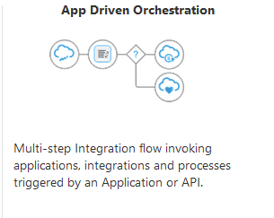

# Invoke queries on Oracle Blockchain Platform (OBP) using Oracle Integrator Cloud (OIC)

## Introduction

This workshop is to educate customers on how to invoke queries on Oracle Blockchain Platform (OBP) using an App Driven Integration on Oracle Integrator Cloud (OIC). One of the main methods of invoking the blockchain on OBP is through an API. This lab deploys a sample chaincode (BalanceTransfer) on OBP. 

Estimated Time: 45 minutes

### Objectives

In this lab, you will complete the following tasks:

- Initialize OBP
- Build connection to OBP
- Build integration in OIC
- Test the integration

### Prerequisites

This lab assumes you have:
- An Oracle Always Free/Free Tier, Paid or LiveLabs Cloud Account
- OBP instance deployed
- OIC instance deployed

## Learn more about OBP
- [Use the REST APIs to Develop Applications](https://docs.oracle.com/en/cloud/paas/blockchain-cloud/usingoci/use-rest-apis-develop-applications.html)
- [OBP REST Endpoints](https://docs.oracle.com/en/cloud/paas/blockchain-cloud/restoci/rest-endpoints.html)

## Acknowledgements

- **Author**- Nicholas Cusato, Santa Monica Specialists Hub, August 22, 2022
- **Contributers**- Jens Lusebrink, Christophe Peytier
- **Last Updated By/Date** - Nicholas Cusato, August 22, 2022