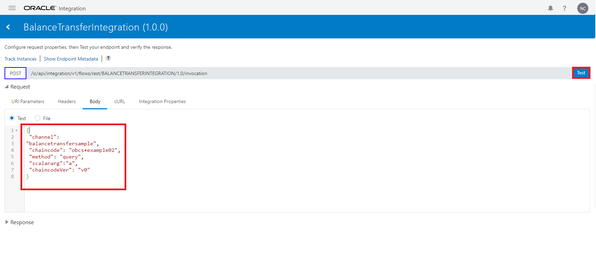

# Test the Integration

## Introduction

In this lab, we will test the integration we created in the previous lab.
Estimated Time: 5 minutes


### Objectives

In this lab, you will complete the following tasks:

- Test the integration

### Prerequisites

This lab assumes you have:
- An Oracle Always Free/Free Tier, Paid or LiveLabs Cloud Account

## Task 1: Test the integration

1. With the OIC integration menu open, hover your mouse over the newly created integration **BalanceTransferIntegration** and select the **play button** to run the integration. 

     

2. Select **Test** in the pop up window.

     

3. Select **Body** from the top menu. 

     

4. Copy and paste the following JSON payload that you 
have used earlier into the text region. Select **Test** to verify.

    ```
    <copy>
    {
    "channel": "balancetransfer",
    "chaincode": "obcs-example02-node",
    "method": "query",
    "scalararg":["a"],
    "chaincodeVer": "v0"
    }
    </copy>
    ```
    
     

5. A successful query will provide the following output:

     


## Acknowledgements

- **Author**- Nicholas Cusato, Santa Monica Specialists Hub, August 22, 2022
- **Contributers**- Rodrigo Mendoza, Ethan Shmargad, Thea Lazarova
- **Last Updated By/Date** - Nicholas Cusato, August 22, 2022